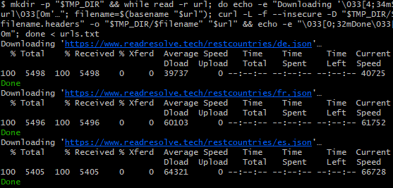

**The console**, which is also called the command prompt, is an input/output interface and is usually physical or system-based, like the screen or the keyboard.
It is the interface for entering commands and displaying output.
**A terminal** reproduces the console behavior in a graphic window.
In fact, it communicates with the Shell. It sends the commands to the shell and in return receives the results.
**The shell** receives the commands that were sent by the terminal and sends back the results.

**A command** is an instruction given to the shell to perform a specific task. Its arguments are used to realize different options, which usually start by (- / --).


**To process the command**, the shell takes many steps:
- Shell reads the typed line in the terminal.

- Shell splits the line into command and arguments.

- It looks for the command in the directories listed in $PATH. If it finds it, then it runs it, and if not, then it sends an error.

- The command runs and performs its task.

- Shell returns the result to the terminal to be viewed.


J'ai commencé par par me déplacer dans le dossier Archiving_shell_commands avec cette commande :
```shell
cd Archiving_shell_commands
```

J'ai utilisé, ensuite, ces commandes pour vérifier l'existance du fichier README.md et pour le modifier ;
```shell
touch README.md
nano README.md
```


**Prints > Bash script starting at: <DATE> where <DATE> is the current formatted date and time. Example with the expected format: 2024-10-15T14:52:04.295+0200**

J'ai commencé par tester pour afficher simplement la date
```shell
$ echo "Script starting at : " $(date)
Script starting at :  Wed Nov 19 07:14:53 2025
```
J'ai ensuite affiché la date sur le format demandé : 
```shell
$ echo "Script starting at : " $(date +"%Y-%m-%d T: %H:%M:S.%3N%z")
Script starting at :  2025-11-19 T: 07:13:S.200+0100
```

**Prints Script full path: '<PATH_TO_FILE>run.sh' where <PATH_TO_FILE> is the absolute path to the script. The path is not hard coded, it is dynamically retrieved**
Dans cette partie j'ai commencé par créer le fichier run.sh en utilisant cette commande  pour le remplir avec cat urls.txt:

```shell
nano run.sh
```
J'ai aussi créer le fichier urls.txt avec :

```shell
nano urls.txt
```
Pour le remplir avec les différentes urls qui sont montré dans l'exemple.  

Enfin j'ai utilisé cette commande pour avoir ce résultat :

```shell
$ sh run.sh
https://www.readresolve.tech/restcountries/de.json
https://www.readresolve.tech/restcountries/fr.json
https://www.readresolve.tech/restcountries/es.json
```
Afin d'afficher le chemin j'ai utilisé cette commande 
```shell
$ realpath run.sh
/c/Users/ilyes/OneDrive/Bureau/project shell/Archiving_shell_commands/run.sh
```

pour afficher le chemain absolu, j'ai commencé par déclarer une variable :
```shell
$ script_path=$(realpath "$0")
```

J'ai ensuite affiché le chemin absolu : 
```shell
$ echo "Script full path: '$(realpath "$0")'"
Script full path: '/usr/bin/bash'
```
Le $0 représente le script exécuté et le realpath représente le chemin absolu.

Pour affiché les droits j'utilise : 
```shell
$ ls -l run.sh
-rw-r--r-- 1 ilyes 197609 13 Nov 10 14:55 run.sh
```
J'utilise cette commande pour ajouter tous les droits :  
```shell
$ chmod +x "run.sh"
```
**(Re)creates a temporary directory in order to store temporary files. You are free to name the directory as you like, be pro, this name is not an argument of the script, it can be hard coded**  

Afin de créer une directory temporaire, je commence par définir une variable :  

```shell 
$ TMP_DIR="./.tmp_file"
```
```shell
$ mkdir -p "$TMP_DIR"; echo "La directory temporaire est créée sur : '$TMP_DIR'"La directory temporaire est créée sur : './.tmp_file'

```

**Downloads each JSON file (listed in the file containing the list of URLs) keeping track of the HTTP response headers**  

- **Prints > Downloading '<URL>'… where <URL> is the current URL being called. The "URL" is displayed in blue and underlined in the terminal**
```shell
$ while read url; do echo -e "> Downloading '\033[4;34m${url}\033[0m'…"; done < urls.txt
> Downloading 'https://www.readresolve.tech/restcountries/de.json'…
> Downloading 'https://www.readresolve.tech/restcountries/fr.json'…
> Downloading 'https://www.readresolve.tech/restcountries/es.json'…
```
- **Each JSON file is stored in the temporary directory keeping the original file name (e.g. fr.json)**
```shell
$ mkdir -p "$TMP_DIR" && while read -r url; do echo -e "Downloading '\033[4;34m$url\033[0m'…"; curl -L -f --insecure -o "$TMP_DIR/$(basename "$url")" "$url"; done < urls.txt
Downloading 'https://www.readresolve.tech/restcountries/de.json'…
  % Total    % Received % Xferd  Average Speed   Time    Time     Time  Current
                                 Dload  Upload   Total   Spent    Left  Speed
100  5498  100  5498    0     0  43327      0 --:--:-- --:--:-- --:--:-- 43984
Downloading 'https://www.readresolve.tech/restcountries/fr.json'…
  % Total    % Received % Xferd  Average Speed   Time    Time     Time  Current
                                 Dload  Upload   Total   Spent    Left  Speed
100  5496  100  5496    0     0  67119      0 --:--:-- --:--:-- --:--:-- 69569
Downloading 'https://www.readresolve.tech/restcountries/es.json'…
  % Total    % Received % Xferd  Average Speed   Time    Time     Time  Current
                                 Dload  Upload   Total   Spent    Left  Speed
100  5405  100  5405    0     0  65647      0 --:--:-- --:--:-- --:--:-- 67562
```

- **Each HTTP response headers (for each downloaded file) is stored in the temporary directory in a file with a name based on the JSON original file name and the .headers suffix (e.g. fr.json.headers)**

```shell
$ mkdir -p "$TMP_DIR" && while read -r url; do echo -e "Downloading '\033[4;34m$url\033[0m'…"; filename=$(basename "$url"); curl -L -f --insecure -D "$TMP_DIR/$filename.headers" -o "$TMP_DIR/$filename" "$url"; done < urls.txt
Downloading 'https://www.readresolve.tech/restcountries/de.json'…
  % Total    % Received % Xferd  Average Speed   Time    Time     Time  Current
                                 Dload  Upload   Total   Spent    Left  Speed
100  5498  100  5498    0     0  47746      0 --:--:-- --:--:-- --:--:-- 49089
Downloading 'https://www.readresolve.tech/restcountries/fr.json'…
  % Total    % Received % Xferd  Average Speed   Time    Time     Time  Current
                                 Dload  Upload   Total   Spent    Left  Speed
100  5496  100  5496    0     0  70989      0 --:--:-- --:--:-- --:--:-- 73280
Downloading 'https://www.readresolve.tech/restcountries/es.json'…
  % Total    % Received % Xferd  Average Speed   Time    Time     Time  Current
                                 Dload  Upload   Total   Spent    Left  Speed
100  5405  100  5405    0     0  70341      0 --:--:-- --:--:-- --:--:-- 73040
```

- **Prints  Done after each processed URL. "Done" is displayed in green in the terminal**


